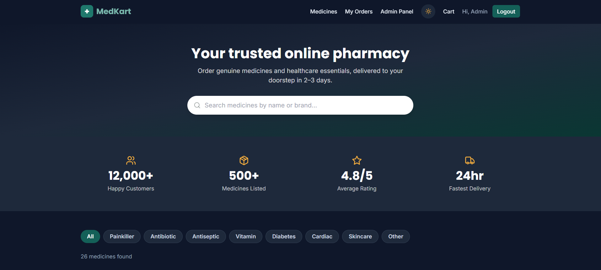
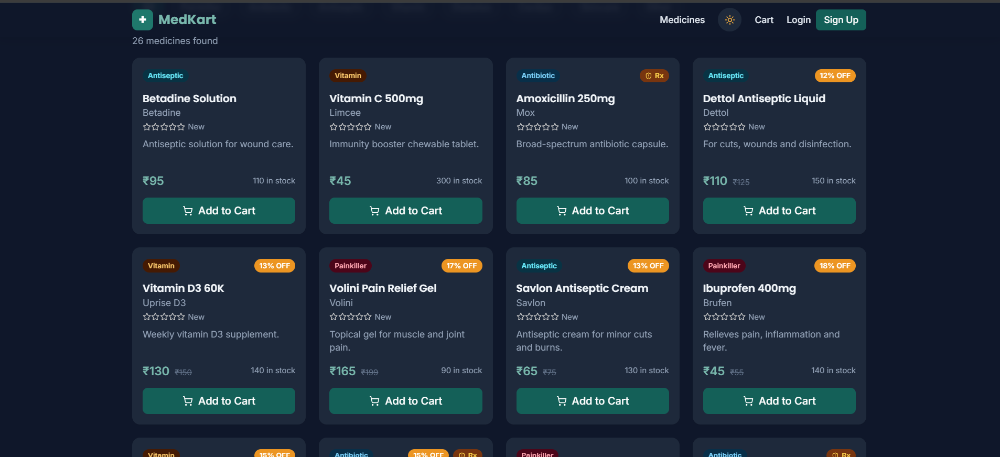
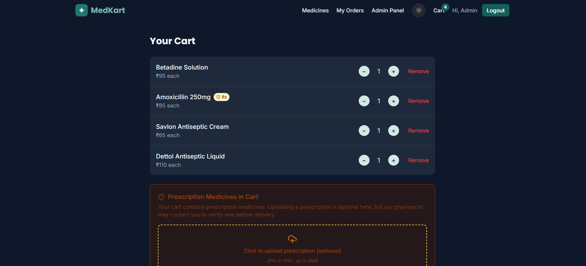
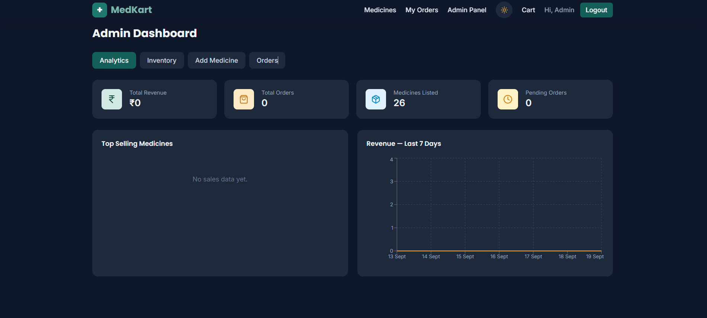

<div align="center">

# 💊 MedKart — Online Pharmacy Management System

**A production-style MERN e-pharmacy: browse medicines, upload prescriptions, check out, and manage the whole store from an analytics-driven admin panel.**

[](https://react.dev)
[](https://vitejs.dev)
[](https://tailwindcss.com)
[](https://nodejs.org)
[](https://expressjs.com)
[](https://mongodb.com)
[](https://jwt.io)
[](LICENSE)

[Live Demo](https://medkart-online-pharmacy-management.vercel.app/) · [Report Bug](../../issues) · [Request Feature](../../issues)

</div>

---

## 📖 Overview

MedKart is a full-stack online pharmacy platform built on the MERN stack. It models the real workflow of a pharmacy business end to end — a customer-facing storefront with search, reviews and prescription-aware checkout, and an admin console for inventory, order fulfilment and revenue analytics.

The project was built to be **demo-ready**: seed the database with one command, log in as admin, and every screen has real data behind it.

**Why it's more than a CRUD app**

- Stock is decremented **transactionally at checkout**, with server-side validation that rejects orders exceeding available inventory
- Prescription-only medicines are flagged at the catalog level and propagate through cart → order → admin verification
- Reviews are enforced **one-per-user-per-medicine** with a unique compound index, and roll up into a cached `avgRating` on each medicine
- Every protected route is guarded twice: JWT middleware on the API and route guards on the client
- The admin dashboard computes revenue trends and top sellers from live order data

---

## ✨ Features

### 🛒 Customer

| Feature | Details |
|---|---|
| **Medicine catalog** | Server-side search across name and brand, category filters, paginated results |
| **Product detail pages** | Brand, manufacturer, expiry, MRP vs. selling price, live stock badge |
| **Ratings & reviews** | 5-star reviews with comments; one review per user per medicine |
| **Cart** | Persistent cart via React Context, quantity adjustment, live order total |
| **Prescription upload** | Attach a prescription image at checkout when the cart contains Rx medicines |
| **Checkout** | COD and Online payment modes, shipping address and phone capture |
| **Order tracking** | Visual order stepper — Pending → Confirmed → Shipped → Delivered |
| **Dark mode** | System-preference aware, persisted to `localStorage` |

### 🛡️ Admin

| Feature | Details |
|---|---|
| **Inventory CRUD** | Create, edit and delete medicines across 8 categories |
| **Order management** | View every order with customer details; update fulfilment status |
| **Revenue analytics** | Recharts area chart of the revenue trend + bar chart of top-selling medicines |
| **Live KPIs** | Total revenue, pending orders, catalog size at a glance |
| **Prescription review** | Inspect uploaded prescriptions attached to Rx orders |

### ⚙️ Engineering

- **JWT authentication** with bcrypt-hashed passwords (10-round salt) and role-based authorization middleware
- **Route-level code splitting** — every page except the landing route is lazy-loaded, keeping the initial bundle small
- **Text indexes** on medicine name, brand and category for fast lookups
- **Centralised Axios instance** with an auth interceptor, plus a global Express error handler and 404 fallback
- **GSAP + Tailwind** landing page with animated stats, testimonials, FAQ and a how-it-works section

---

## 🧱 Tech Stack

| Layer | Technologies |
|---|---|
| **Frontend** | React 18, Vite 5, React Router 6, Tailwind CSS 3, Axios, Recharts, GSAP, lucide-react, react-hot-toast |
| **Backend** | Node.js, Express 4, Mongoose 8, JSON Web Tokens, bcryptjs, Morgan, CORS |
| **Database** | MongoDB (local or Atlas) |
| **Tooling** | Nodemon, PostCSS, Autoprefixer, dotenv |

---

## 🏗️ Architecture

```
React (Vite) ──HTTP/JSON──►  Express REST API  ──Mongoose──►  MongoDB
     │                              │
 AuthContext                  JWT middleware
 CartContext                  role guard (adminOnly)
 ThemeContext                 global error handler
```

```
MedKart-Pharmacy-Management-System/
├── backend/
│   ├── config/db.js                 # MongoDB connection
│   ├── models/                      # User, Medicine, Order, Review
│   ├── controllers/                 # auth, medicine, order, review
│   ├── routes/                      # /api/auth, /api/medicines, /api/orders
│   ├── middleware/auth.js           # protect + adminOnly
│   ├── seed.js                      # admin user + 20 sample medicines
│   └── server.js
└── frontend/
    └── src/
        ├── api/axios.js             # base URL + token interceptor
        ├── context/                 # Auth, Cart, Theme
        ├── components/              # Navbar, MedicineCard, OrderStepper, FAQ, …
        └── pages/                   # Medicines, MedicineDetail, Cart, Orders,
                                     # OrderConfirmation, Login, Register, AdminDashboard
```

---

## 🗃️ Data Model

| Collection | Key fields |
|---|---|
| **User** | `name`, `email` (unique), `password` (hashed), `phone`, `address`, `role` (`customer` \| `admin`) |
| **Medicine** | `name`, `brand`, `category` (enum, 8 values), `price`, `mrp`, `stock`, `requiresPrescription`, `manufacturer`, `expiryDate`, `avgRating`, `numReviews` |
| **Order** | `user`, `items[]` (medicine, name, qty, price), `totalAmount`, `shippingAddress`, `phone`, `status` (enum), `paymentMethod`, `paymentStatus`, `prescriptionImage`, `requiresPrescription` |
| **Review** | `medicine`, `user`, `userName`, `rating` (1–5), `comment` — unique index on `{ medicine, user }` |

---

## 🔌 API Reference

Base URL: `http://localhost:5000/api`

### Auth

| Method | Endpoint | Access | Description |
|---|---|---|---|
| `POST` | `/auth/register` | Public | Create a customer account, returns JWT |
| `POST` | `/auth/login` | Public | Authenticate, returns JWT |
| `GET` | `/auth/profile` | Private | Current user profile |

### Medicines

| Method | Endpoint | Access | Description |
|---|---|---|---|
| `GET` | `/medicines?search=&category=&page=&limit=` | Public | Paginated, searchable catalog |
| `GET` | `/medicines/:id` | Public | Single medicine |
| `GET` | `/medicines/:id/reviews` | Public | Reviews for a medicine |
| `POST` | `/medicines/:id/reviews` | Private | Add a review (one per user) |
| `POST` | `/medicines` | Admin | Create medicine |
| `PUT` | `/medicines/:id` | Admin | Update medicine |
| `DELETE` | `/medicines/:id` | Admin | Delete medicine |

### Orders

| Method | Endpoint | Access | Description |
|---|---|---|---|
| `POST` | `/orders` | Private | Place an order (validates stock, decrements inventory) |
| `GET` | `/orders/myorders` | Private | Current user's order history |
| `GET` | `/orders` | Admin | All orders with customer details |
| `PUT` | `/orders/:id/status` | Admin | Update fulfilment status |

<details>
<summary><b>Sample request — place an order</b></summary>

```http
POST /api/orders
Authorization: Bearer <token>
Content-Type: application/json

{
  "items": [{ "medicineId": "66b1f...", "quantity": 2 }],
  "shippingAddress": "221B Baker Street, Prayagraj",
  "phone": "9876543210",
  "paymentMethod": "COD",
  "prescriptionImage": "data:image/png;base64,..."
}
```
</details>

---

## 🚀 Getting Started

### Prerequisites

- Node.js **18+**
- MongoDB running locally, or a MongoDB Atlas connection string

### 1 · Clone

```bash
git clone https://github.com/abhishekyadav77/MedKart-Pharmacy-Management-System.git
cd MedKart-Pharmacy-Management-System
```

### 2 · Backend

```bash
cd backend
npm install
cp .env.example .env
npm run dev          # http://localhost:5000
```

`.env`

```env
PORT=5000
MONGO_URI=mongodb://127.0.0.1:27017/pharmacy_db
JWT_SECRET=replace_this_with_a_long_random_secret
JWT_EXPIRE=7d
CLIENT_URL=http://localhost:5173
```

### 3 · Seed demo data

```bash
node seed.js
```

Creates an admin account plus a catalog of sample medicines across all categories.

```
Email: PRIVATE
Password: PRIVATE
```


### 4 · Frontend

In a second terminal:

```bash
cd frontend
npm install
cp .env.example .env     # VITE_API_URL=http://localhost:5000/api
npm run dev              # http://localhost:5173
```

### 5 · Try it out

1. Browse the catalog, open a medicine, leave a review
2. Add items to the cart and check out — attach a prescription if the cart has Rx items
3. Watch stock drop and track the order on the stepper
4. Log in as admin → **Admin Panel** → edit inventory, advance order status, read the analytics

---

## 📸 Screenshots


| Storefront | Medicine Detail |
|---|---|
|  |  |

| Cart & Checkout | Admin Dashboard |
|---|---|
|  |  |

---

## 🗺️ Roadmap

- [ ] Razorpay / Stripe payment gateway integration
- [ ] Cloudinary-backed prescription storage (replacing base64)
- [ ] Email and SMS notifications on order status change
- [ ] Pharmacist role with a dedicated prescription-verification queue
- [ ] Low-stock and near-expiry alerts on the admin dashboard
- [ ] Delivery agent role with live order tracking
- [ ] Jest + Supertest API test suite and CI on GitHub Actions
- [ ] Docker Compose setup for one-command local spin-up

---

## 🤝 Contributing

Contributions are welcome.

1. Fork the repo
2. `git checkout -b feature/your-feature`
3. `git commit -m "feat: add your feature"`
4. `git push origin feature/your-feature`
5. Open a Pull Request

---

## 📄 License

Distributed under the MIT License. See `LICENSE` for details.

---

## 👤 Author

**Abhishek**
Final-year B.Tech CSE student · Full-stack (MERN) developer

[](https://github.com/abhishekyadav77)
[](https://www.linkedin.com/in/abhishek-yadav-mzp)

<div align="center">

⭐ **If this project helped you, consider giving it a star.**

</div>
